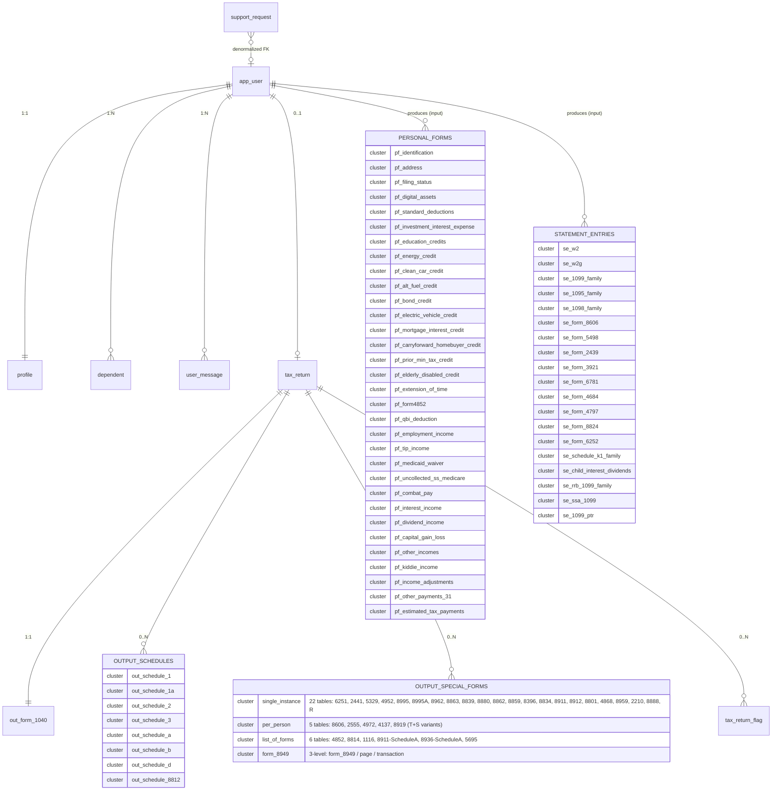
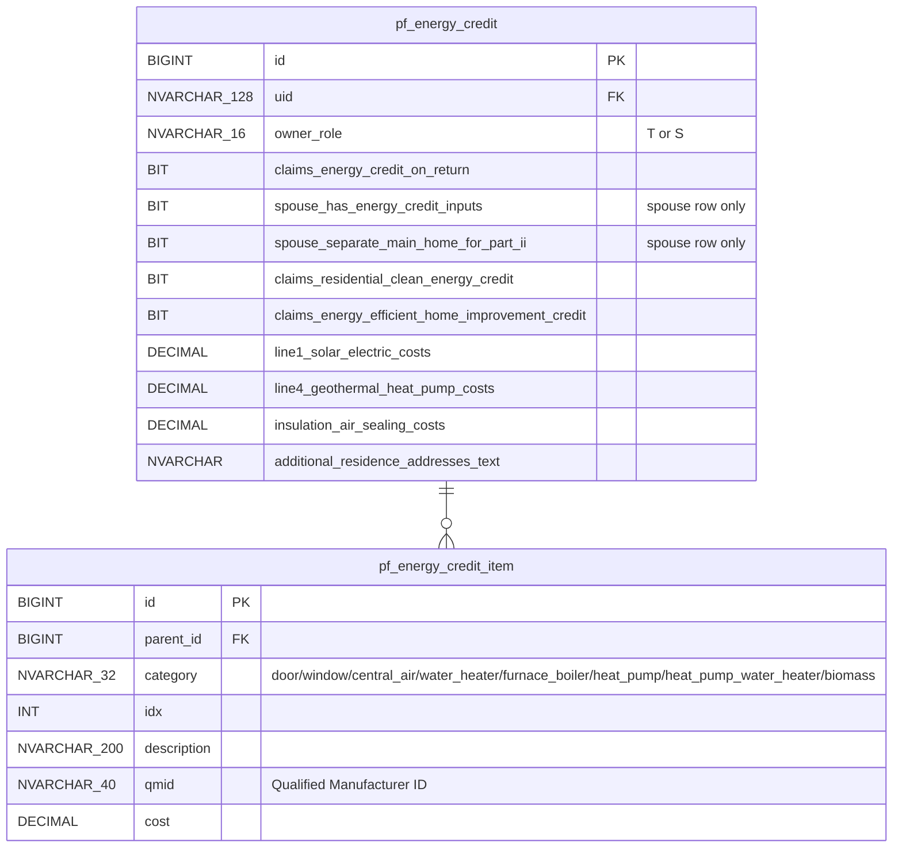
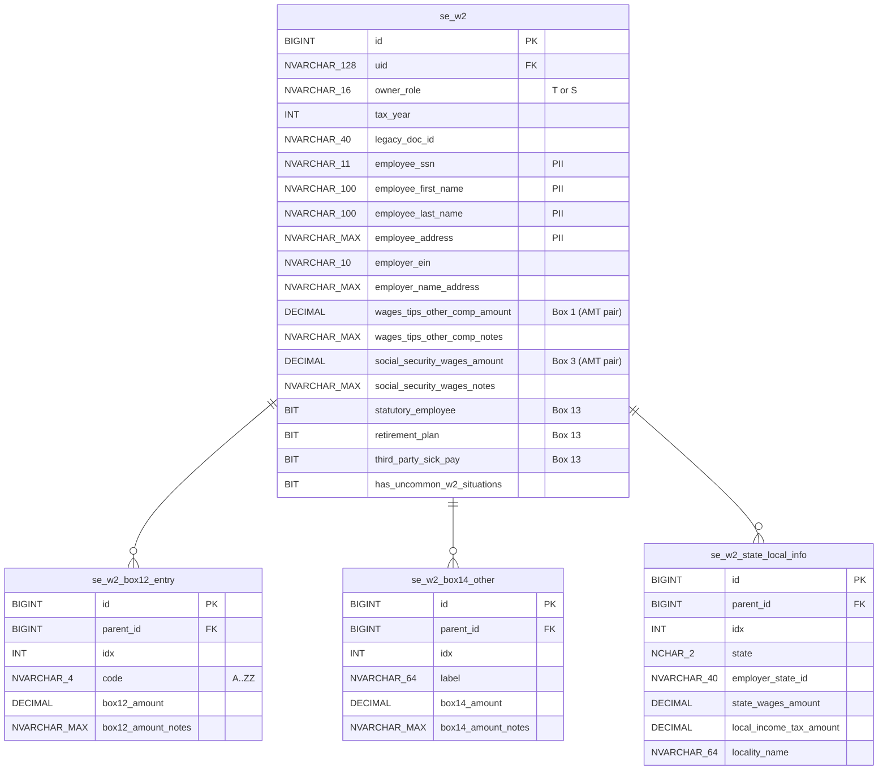
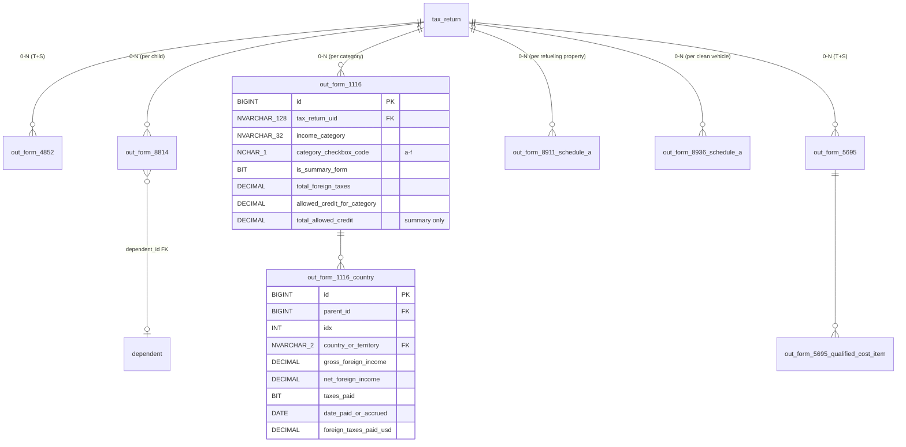

# US Tax — Entity-Relationship Diagrams (Phase 2b)

Companion to `data_model_schema.md`. The schema has ~181 tables; a single ER
diagram would be unreadable. This document breaks it into:

- §1 **Top-level domain overview** — domain clusters + cross-domain edges
- §2 Core entities detail
- §3 Personal-forms domain detail (Identity / Credits / Income clusters)
- §4 Statement-entries domain detail
- §5 Output domain detail (tax_return + Form 1040 + Schedules)
- §6 Output special-forms detail (38 forms; split into 3 sub-views)

Diagrams use Mermaid `erDiagram` syntax. Cardinality notation:

- `||--o{` — one-to-many (optional on the many side)
- `||--||` — strict one-to-one
- `||--o|` — one-to-zero-or-one
- `}o--o{` — many-to-many (none in this schema; everything is normalized)

Attribute lists in each entity are intentionally abbreviated — refer to
`data_model_schema.md` for the full column list per table.

---

## 1. Top-level domain overview



---

## 2. Core entities

```mermaid
erDiagram
    app_user {
        NVARCHAR_128 uid PK
        DATETIMEOFFSET created_at
        DATETIMEOFFSET last_login_at
    }
    profile {
        NVARCHAR_128 uid PK_FK
        NVARCHAR_100 first_name "PII"
        NVARCHAR_100 last_name "PII"
        NVARCHAR_255 email "PII, UNIQUE filtered"
        NVARCHAR_25 phone "PII"
        NVARCHAR_200 address_line_1 "PII"
        NVARCHAR_100 city
        NVARCHAR_100 state
        NVARCHAR_20 postal_code
    }
    dependent {
        BIGINT id PK
        NVARCHAR_128 uid FK
        NVARCHAR_40 legacy_doc_id
        NVARCHAR_100 first_name "PII"
        NVARCHAR_100 last_name "PII"
        NVARCHAR_11 ssn "PII"
        DATE date_of_birth "PII"
        NVARCHAR_32 relationship FK
        BIT qualifies_for_ctc
        BIT qualifies_for_odc
        TINYINT months_lived_with_taxpayer
    }
    user_message {
        BIGINT id PK
        NVARCHAR_128 uid FK
        NVARCHAR_200 subject
        NVARCHAR_MAX body
        DATETIMEOFFSET created_at
        DATETIMEOFFSET read_at
    }
    support_request {
        BIGINT id PK
        NVARCHAR_128 uid FK_nullable
        NVARCHAR_200 subject
        NVARCHAR_MAX message
        NVARCHAR_200 user_name "PII snapshot"
        NVARCHAR_25 user_phone "PII snapshot"
        NVARCHAR_255 user_email "PII snapshot"
        NVARCHAR_32 status "open/in_progress/resolved"
        DATETIMEOFFSET created_at
    }
    ref_relationship {
        NVARCHAR_32 code PK
        NVARCHAR_64 label
    }
    app_user ||--|| profile : "1:1 CASCADE"
    app_user ||--o{ dependent : "1:N CASCADE"
    app_user ||--o{ user_message : "1:N CASCADE"
    app_user ||--o{ support_request : "1:N SET NULL"
    dependent }o--|| ref_relationship : "FK"
```

---

## 3. Personal-forms domain

### 3.1 Identity cluster (§2 of schema)

```mermaid
erDiagram
    app_user ||--o{ pf_identification : "1:N (T+S)"
    app_user ||--|| pf_address : "1:1"
    app_user ||--o{ pf_digital_assets : "1:N (T+S)"
    app_user ||--|| pf_filing_status : "1:1"

    pf_identification {
        BIGINT id PK
        NVARCHAR_128 uid FK
        NVARCHAR_16 owner_role "taxpayer|spouse"
        NVARCHAR_100 first_name "PII"
        NVARCHAR_100 last_name "PII"
        NVARCHAR_11 ssn "PII"
        DATE date_of_birth "PII"
        NVARCHAR_100 occupation
        NVARCHAR_6 identity_protection_pin "PII"
        NVARCHAR_MAX extra_payload_json
    }
    pf_address {
        BIGINT id PK
        NVARCHAR_128 uid FK_UNIQUE
        BIT is_foreign_address
        BIT is_main_home_in_usa
        NVARCHAR_200 street_address "PII"
        NCHAR_2 state_code FK
        NVARCHAR_10 zip_code
        NVARCHAR_2 foreign_country FK
        NVARCHAR_255 email_address "PII"
    }
    pf_digital_assets {
        BIGINT id PK
        NVARCHAR_128 uid FK
        NVARCHAR_16 owner_role
        BIT had_activity
    }
    pf_filing_status {
        NVARCHAR_128 uid PK_FK
        NVARCHAR_8 filing_status FK
        NVARCHAR_200 spouse_name_if_mfs "PII"
        NVARCHAR_200 qualifying_child_name_if_hoh_or_qss "PII"
        BIT treating_nonresident_spouse_as_us_resident
    }

    ref_us_state ||--o{ pf_address : "state_code"
    ref_country ||--o{ pf_address : "foreign_country"
    ref_filing_status ||--o{ pf_filing_status : "filing_status"
```

### 3.2 Credits/Deductions cluster (§3 of schema)

Per-archetype tables (each FKs to `app_user.uid`). Child-table edges shown
for the 6 archetypes that have children.

```mermaid
erDiagram
    app_user ||--o{ pf_standard_deductions : "0-2"
    app_user ||--o| pf_investment_interest_expense : "0-1"
    app_user ||--o{ pf_education_credits : "0-2"
    app_user ||--o{ pf_energy_credit : "0-2"
    app_user ||--o{ pf_clean_car_credit : "0-2"
    app_user ||--o{ pf_alt_fuel_credit : "0-2"
    app_user ||--o{ pf_bond_credit : "0-2"
    app_user ||--o{ pf_electric_vehicle_credit : "0-2"
    app_user ||--o{ pf_mortgage_interest_credit : "0-2"
    app_user ||--o{ pf_carryforward_homebuyer_credit : "0-2"
    app_user ||--o{ pf_prior_min_tax_credit : "0-2"
    app_user ||--o{ pf_elderly_disabled_credit : "0-2"
    app_user ||--o{ pf_extension_of_time : "0-2"
    app_user ||--o{ pf_form4852 : "0-2"
    app_user ||--o{ pf_qbi_deduction : "0-2"

    pf_education_credits ||--o{ pf_education_student : "0-N students per gate"
    pf_energy_credit ||--o{ pf_energy_credit_item : "0-N items, 8 categories"
    pf_clean_car_credit ||--o{ pf_clean_car_vehicle : "0-N vehicles"
    pf_alt_fuel_credit ||--o{ pf_alt_fuel_property : "0-N properties"
    pf_bond_credit ||--o{ pf_bond_1097btc : "0-N 1097-BTC rows"
    pf_bond_credit ||--o{ pf_bond_direct : "0-N direct bonds"
    pf_form4852 ||--o{ pf_form4852_entry : "0-N substitute W-2/1099-R"
```



Representative parent + child attribute detail:



### 3.3 Income cluster (§4 of schema)

```mermaid
erDiagram
    app_user ||--o{ pf_employment_income : "0-2"
    app_user ||--o{ pf_tip_income : "0-2"
    app_user ||--o{ pf_medicaid_waiver : "0-2"
    app_user ||--o{ pf_uncollected_ss_medicare : "0-2"
    app_user ||--o{ pf_combat_pay : "0-2"
    app_user ||--o{ pf_interest_income : "0-2"
    app_user ||--o{ pf_dividend_income : "0-2"
    app_user ||--o{ pf_capital_gain_loss : "0-2-N (dependent rows)"
    app_user ||--o{ pf_other_incomes : "0-2"
    app_user ||--o{ pf_kiddie_income : "0-1-N (dependent rows)"
    app_user ||--o{ pf_income_adjustments : "0-2"
    app_user ||--o| pf_other_payments_31 : "0-1"
    app_user ||--o{ pf_estimated_tax_payments : "0-2"

    pf_employment_income ||--o{ pf_household_employer : ""
    pf_tip_income ||--o{ pf_tip_employer : ""
    pf_medicaid_waiver ||--o{ pf_medicaid_waiver_entry : ""
    pf_uncollected_ss_medicare ||--o{ pf_uncollected_firm : ""
    pf_capital_gain_loss ||--o{ pf_capital_gain_loss_transaction : ""
    pf_other_incomes ||--o{ pf_other_income_item : ""
    pf_income_adjustments ||--o{ pf_income_adjustment_item : ""
    pf_other_payments_31 ||--o{ pf_other_payment_item : ""

    pf_capital_gain_loss }o--o| dependent : "dependent_id FK (when owner_role='dependent')"
    pf_kiddie_income }o--o| dependent : "dependent_id FK"
```



Dependent-scoped rows (the `}o--o|` edges above) cover the
`users/{uid}/dependents/{dependentId}/personal/{formId}` Firestore path
discovered in the income inventory.

---

## 4. Statement-entries domain (§5 of schema)

Sub-clusters by category. Cardinality on every parent is `app_user ||--o{`
(many entries per user-form pair).

```mermaid
erDiagram
    app_user ||--o{ se_w2 : "0-N"
    app_user ||--o{ se_w2g : "0-N"
    app_user ||--o{ se_1099_nec : "0-N"
    app_user ||--o{ se_1099_misc : "0-N"
    app_user ||--o{ se_1099_k : "0-N"
    app_user ||--o{ se_1099_int : "0-N"
    app_user ||--o{ se_1099_div : "0-N"
    app_user ||--o{ se_1099_oid : "0-N"
    app_user ||--o{ se_1099_b : "0-N"
    app_user ||--o{ se_1099_da : "0-N"
    app_user ||--o{ se_1099_r : "0-N"
    app_user ||--o{ se_1099_a : "0-N"
    app_user ||--o{ se_1099_c : "0-N"
    app_user ||--o{ se_1099_g : "0-N"
    app_user ||--o{ se_1099_s : "0-N"
    app_user ||--o{ se_1099_q : "0-N"
    app_user ||--o{ se_1099_qa : "0-N"
    app_user ||--o{ se_1099_ltc : "0-N"
    app_user ||--o{ se_1099_sa : "0-N"
    app_user ||--o{ se_1099_cap : "0-N"
    app_user ||--o{ se_1099_ptr : "0-N"
    app_user ||--o{ se_1095_a : "0-N"
    app_user ||--o{ se_1095_b : "0-N"
    app_user ||--o{ se_1095_c : "0-N"
    app_user ||--o{ se_1098_t : "0-N"
    app_user ||--o{ se_1098_e : "0-N (formId 1099-e)"
    app_user ||--o{ se_form_8606 : "0-2 per person"
    app_user ||--o{ se_form_5498 : "0-N"
    app_user ||--o{ se_form_2439 : "0-N"
    app_user ||--o{ se_form_3921 : "0-N"
    app_user ||--o{ se_form_6781 : "0-N (opaque-slot)"
    app_user ||--o{ se_form_4684 : "0-N (opaque-slot)"
    app_user ||--o{ se_form_4797 : "0-N (opaque-slot)"
    app_user ||--o{ se_form_8824 : "0-N (opaque-slot)"
    app_user ||--o{ se_form_6252 : "0-N (opaque-slot)"
    app_user ||--o{ se_schedule_k1_1041 : "0-N"
    app_user ||--o{ se_schedule_k1_1065 : "0-N"
    app_user ||--o{ se_schedule_k1_1120s : "0-N"
    app_user ||--o{ se_rrb_1099 : "0-N"
    app_user ||--o{ se_rrb_1099_r : "0-N"
    app_user ||--o{ se_ssa_1099 : "0-N"
    app_user ||--o{ se_child_interest_dividends : "0-N (per child)"

    se_w2 ||--o{ se_w2_box12_entry : ""
    se_w2 ||--o{ se_w2_box14_other : ""
    se_w2 ||--o{ se_w2_state_local_info : ""
    se_w2g ||--o{ se_w2g_state_local_info : ""
    se_1099_r ||--o{ se_1099_r_state_local_info : ""
    se_1099_int ||--o{ se_1099_int_state_info : ""
    se_1099_div ||--o{ se_1099_div_state_info : ""
    se_1099_oid ||--o{ se_1099_oid_state_info : ""
    se_1099_k ||--o{ se_1099_k_state_information : ""
    se_1099_g ||--o{ se_1099_g_state_info : ""
    se_1099_b ||--o{ se_1099_b_state_info : ""
    se_1099_nec ||--o{ se_1099_nec_state_info : ""
    se_1099_misc ||--o{ se_1099_misc_state_info : ""
    se_1095_a ||--o{ se_1095_a_covered_individual : ""
    se_1095_a ||--o{ se_1095_a_coverage_monthly : ""
    se_1095_b ||--o{ se_1095_b_covered_individual : ""
    se_1095_c ||--o{ se_1095_c_part2_monthly_row : ""
    se_1095_c ||--o{ se_1095_c_part3_covered_individual : ""

    se_child_interest_dividends }o--o| dependent : "dependent_id FK"
```



Representative entity (W-2) showing the AMT-pair pattern:



---

## 5. Output domain — tax_return + Form 1040 + Schedules

```mermaid
erDiagram
    app_user ||--o| tax_return : "0..1"
    tax_return ||--|| out_form_1040 : "1:1"
    tax_return ||--o{ tax_return_flag : "0..N"
    tax_return ||--o{ out_required_attachment_form : "0..N"
    tax_return ||--o| out_schedule_1 : "0..1"
    tax_return ||--o| out_schedule_1a : "0..1"
    tax_return ||--o| out_schedule_2 : "0..1"
    tax_return ||--o| out_schedule_3 : "0..1"
    tax_return ||--o| out_schedule_a : "0..1"
    tax_return ||--o| out_schedule_b : "0..1"
    tax_return ||--o| out_schedule_d : "0..1"
    tax_return ||--o| out_schedule_8812 : "0..1"

    out_form_1040 ||--o{ out_form_1040_dependent : ""
    out_form_1040 ||--o{ out_form_1040_other_earned_income_statement : ""

    out_schedule_1 ||--o{ out_schedule_1_other_income_item : "line 8z"
    out_schedule_1 ||--o{ out_schedule_1_other_adjustment_item : "line 24z"
    out_schedule_2 ||--o{ out_schedule_2_other_addition_item : ""
    out_schedule_2 ||--o{ out_schedule_2_recapture_other_credit_item : ""
    out_schedule_2 ||--o{ out_schedule_2_other_additional_tax_item : ""
    out_schedule_3 ||--o{ out_schedule_3_other_nonrefundable_credit_item : ""
    out_schedule_3 ||--o{ out_schedule_3_other_refundable_credit_item : ""
    out_schedule_b ||--o{ out_schedule_b_interest_item : "Part I"
    out_schedule_b ||--o{ out_schedule_b_dividend_item : "Part II"

    tax_return {
        NVARCHAR_128 uid PK_FK
        DATETIMEOFFSET computed_at
        INT tax_year
        NVARCHAR_16 compute_status "ok/blocked/error"
    }
    out_form_1040 {
        NVARCHAR_128 tax_return_uid PK_FK
        NVARCHAR_100 filer_first_name "PII"
        NVARCHAR_11 filer_ssn "PII"
        DATE filer_date_of_birth "PII"
        NVARCHAR_8 filing_status FK
        DECIMAL income_total_wages_1z
        DECIMAL income_total_income_9
        DECIMAL adjustments_adjusted_gross_income
        DECIMAL deductions_total_14
        DECIMAL tac_regular_tax
        DECIMAL tac_total_tax_24
        DECIMAL pay_total_payments_33
        DECIMAL refund_amount_35a
        DECIMAL amount_owed_37
    }
    out_form_1040_dependent {
        BIGINT id PK
        NVARCHAR_128 tax_return_uid FK
        INT idx
        NVARCHAR_100 first_name "PII"
        NVARCHAR_11 ssn "PII"
        BIT child_tax_credit_eligible
        BIT other_dependent_credit_eligible
    }
    tax_return_flag {
        BIGINT id PK
        NVARCHAR_128 tax_return_uid FK
        INT idx
        NVARCHAR_64 code
        NVARCHAR_MAX message
        BIT blocking
    }
    out_required_attachment_form {
        BIGINT id PK
        NVARCHAR_128 tax_return_uid FK
        NVARCHAR_32 form_code "form_4797|form_4684|schedule_e|..."
        BIT required
        NVARCHAR_MAX requirement_reason
        DECIMAL related_schedule1_amount
    }
```

---

## 6. Output domain — Special forms (split into 3 views)

### 6.1 Single-instance + per-person special forms

```mermaid
erDiagram
    tax_return ||--o| out_form_6251 : ""
    tax_return ||--o| out_form_2441 : ""
    tax_return ||--o| out_form_5329 : ""
    tax_return ||--o| out_form_4952 : ""
    tax_return ||--o| out_form_8995 : ""
    tax_return ||--o| out_form_8995a : ""
    tax_return ||--o| out_form_8962 : ""
    tax_return ||--o| out_form_8863 : ""
    tax_return ||--o| out_form_8839 : ""
    tax_return ||--o| out_form_8880 : ""
    tax_return ||--o| out_form_8862 : ""
    tax_return ||--o| out_form_8859 : ""
    tax_return ||--o| out_form_8396 : ""
    tax_return ||--o| out_form_8834 : ""
    tax_return ||--o| out_form_8911 : ""
    tax_return ||--o| out_form_8912 : ""
    tax_return ||--o| out_form_8801 : ""
    tax_return ||--o| out_form_4868 : ""
    tax_return ||--o| out_form_8959 : ""
    tax_return ||--o| out_form_2210 : ""
    tax_return ||--o| out_form_8888 : ""
    tax_return ||--o| out_schedule_r : ""

    tax_return ||--o{ out_form_8606 : "0-2 (T+S)"
    tax_return ||--o{ out_form_2555 : "0-2 (T+S)"
    tax_return ||--o{ out_form_4972 : "0-2 (T+S)"
    tax_return ||--o{ out_form_4137 : "0-2 (T+S)"
    tax_return ||--o{ out_form_8919 : "0-2 (T+S)"

    out_form_2441 ||--o{ out_form_2441_care_provider : ""
    out_form_2441 ||--o{ out_form_2441_qualifying_person : ""
    out_form_8962 ||--o{ out_form_8962_monthly_row : "12"
    out_form_8962 ||--o{ out_form_8962_policy_allocation : ""
    out_form_8863 ||--o{ out_form_8863_student : ""
    out_form_8839 ||--o{ out_form_8839_child : ""
    out_form_8912 ||--o{ out_form_8912_part_iii_entry : ""
    out_form_8912 ||--o{ out_form_8912_direct_bond_entry : ""
    out_form_2210 ||--o{ out_form_2210_period : "4"
    out_form_8888 ||--o{ out_form_8888_account : "≤3"

    out_form_4137 ||--o{ out_form_4137_employer : ""
    out_form_8919 ||--o{ out_form_8919_firm : ""
```



### 6.2 List-of-forms special forms



### 6.3 Form 8949 (3-level hierarchy)

```mermaid
erDiagram
    tax_return ||--o| out_form_8949 : "0..1"
    out_form_8949 ||--o{ out_form_8949_page : "0-N pages"
    out_form_8949_page ||--o{ out_form_8949_transaction : "0-N rows"

    out_form_8949 {
        NVARCHAR_128 tax_return_uid PK_FK
        NVARCHAR_200 header_name "PII"
        NVARCHAR_11 header_ssn "PII"
        BIT required
        NVARCHAR_MAX requirement_reason
    }
    out_form_8949_page {
        BIGINT id PK
        NVARCHAR_128 tax_return_uid FK
        INT page_sequence
        NVARCHAR_4 part "I or II"
        NVARCHAR_8 term "short or long"
        NCHAR_1 box "A-F"
        DECIMAL total_proceeds
        DECIMAL total_cost_or_other_basis
        DECIMAL total_gain_or_loss
    }
    out_form_8949_transaction {
        BIGINT id PK
        BIGINT page_id FK
        INT idx
        NVARCHAR_64 source
        NVARCHAR_MAX description_of_property
        NVARCHAR_16 date_acquired "DATE or VARIOUS"
        NVARCHAR_16 date_sold_or_disposed
        DECIMAL proceeds
        DECIMAL cost_or_other_basis
        NVARCHAR_8 adjustment_code
        DECIMAL adjustment_amount
        DECIMAL gain_or_loss
    }
```

---

## 7. Notation cheatsheet

Diagrams above abbreviate types to fit Mermaid's identifier-style attribute
names. Translation back to T-SQL:

| Diagram label | T-SQL type |
|---|---|
| `NVARCHAR_128`, `NVARCHAR_100`, `NVARCHAR_200`, `NVARCHAR_MAX`, `NVARCHAR_40`, `NVARCHAR_64`, `NVARCHAR_32`, `NVARCHAR_16`, `NVARCHAR_8`, `NVARCHAR_4`, `NVARCHAR_255`, `NVARCHAR_20`, `NVARCHAR_25`, `NVARCHAR_10`, `NVARCHAR_11`, `NVARCHAR_6` | `NVARCHAR(N)` |
| `NCHAR_1`, `NCHAR_2` | `NCHAR(N)` |
| `DECIMAL` | `DECIMAL(19,4)` (money) or `DECIMAL(7,4)` (rate) |
| `DATE` | `DATE` |
| `DATETIMEOFFSET` | `DATETIMEOFFSET` |
| `BIT` | `BIT` (nullable for tri-state; not-null for strict) |
| `INT` | `INT` |
| `TINYINT` | `TINYINT` |
| `BIGINT` | `BIGINT` (identity for PKs) |

"PII" annotations in the attribute notes correspond to columns flagged in
§0.7 of `data_model_schema.md` for Always Encrypted / column-level
protection.

---

## 8. Diagram coverage summary

| Section | Diagrams | Tables shown |
|---|---|---|
| §1 Top-level overview | 1 | 175+ (clustered) |
| §2 Core entities | 1 | 5 + 1 ref |
| §3 Personal-forms domain | 3 | 31 parents + 14 children |
| §4 Statement-entries domain | 2 | 41 parents + ~13 children |
| §5 Output anchor + Form 1040 + Schedules | 1 | 6 + 16 |
| §6 Output special forms | 3 | ~53 |
| **Total entity coverage** | **11 diagrams** | **~180 of 181 tables** (reference tables not all individually drawn) |

Renders to PNG/SVG via `mermaid-cli`:

```bash
npx -p @mermaid-js/mermaid-cli mmdc -i data_model_er.md -o data_model_er.png
```

(or paste into https://mermaid.live for an in-browser preview.)
